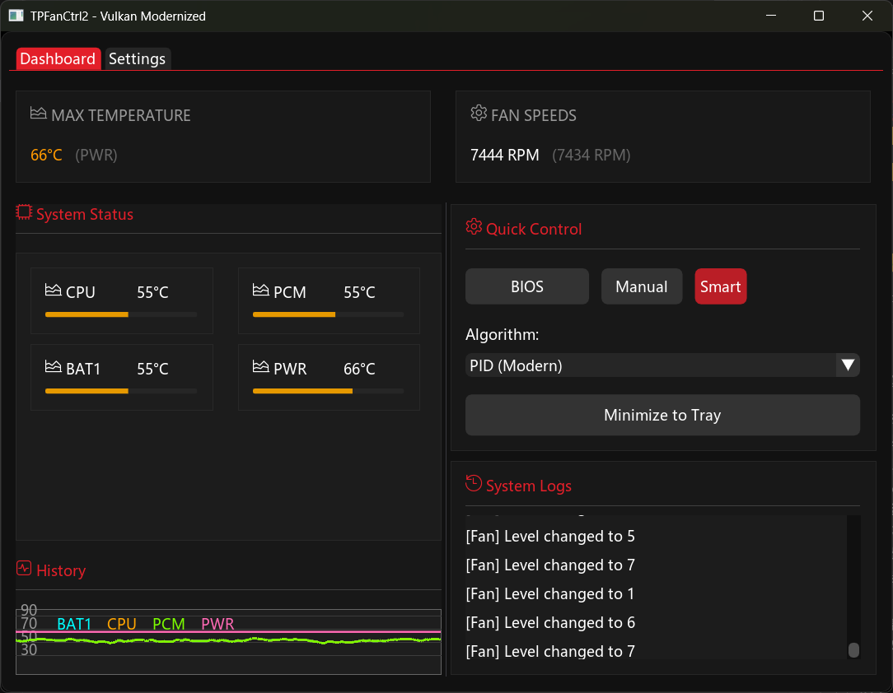
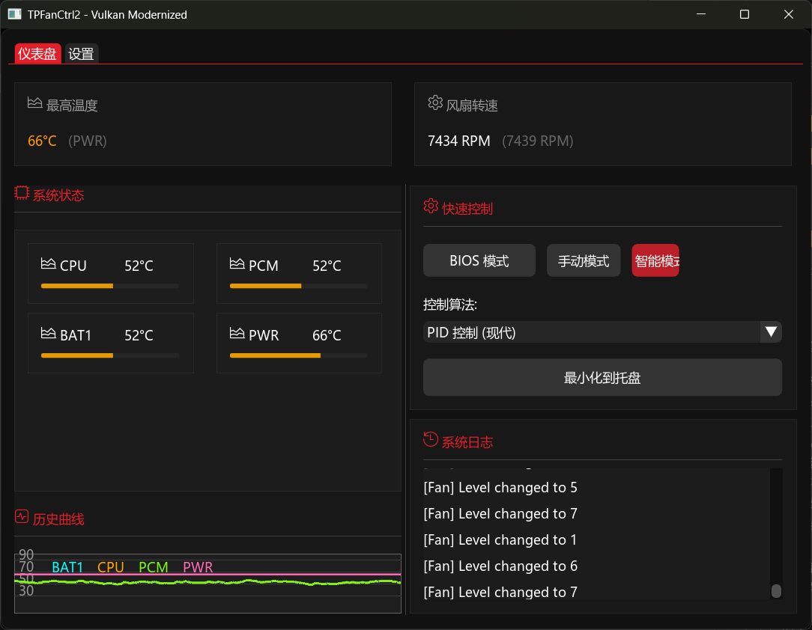
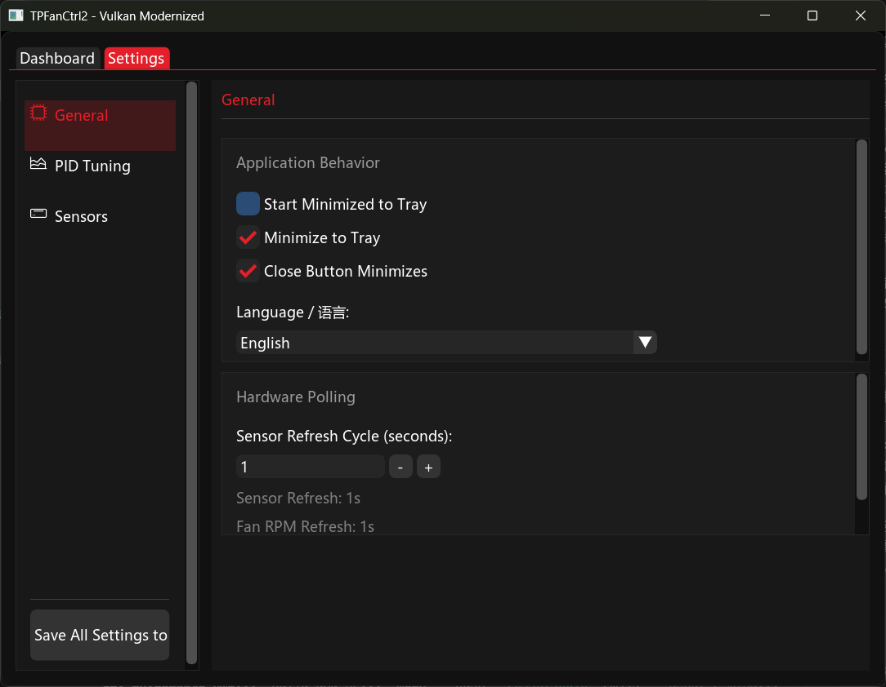

# TPFanCtrl2 

[](https://github.com/Tinnci/TPFanCtrl2/actions/workflows/release.yml)
[](https://github.com/Tinnci/TPFanCtrl2/releases)
[](http://unlicense.org/)

**TPFanCtrl2** is a modernized, high-performance fan control utility for ThinkPad laptops on Windows 10/11. This version is a complete overhaul of the original TPFC, featuring a modern GUI, advanced control algorithms, and full DPI awareness.

## 📸 Screenshots

<p align="center">
  
  
  
</p>

---

## ✨ Key Features

- **Modern UI**: Built with **ImGui** and **Vulkan 1.2** for a smooth, hardware-accelerated experience.
- **Advanced Control**: 
  - **PID Control**: 10Hz closed-loop PID algorithm for precise temperature management.
  - **Smart Mode**: Classic step-based fan curve with hysteresis support.
  - **Dual Fan Support**: Independent or synchronized control for high-end ThinkPad models (P-series, etc.).
- **Robust Sensor Fusion**:
  - **Weighted Max Strategy**: Assign different weights to sensors (e.g., make CPU more "important" than ambient).
  - **Moving Average Smoothing**: 5-sample window to prevent fan jitter from sensor spikes.
  - **Safety Net**: Automatic fallback to BIOS control if temperatures exceed 90°C or sensors fail.
- **DPI Aware**: Fully responsive UI and dynamic tray icons that scale perfectly on 4K+ displays.
- **Internationalization (I18n)**: Built-in support for multiple languages (English, Chinese, etc.).
- **Dynamic Tray Icon**: Real-time temperature and fan speed rendering directly in the system tray using Segoe UI.
- **Lightweight**: No external dependencies required at runtime; minimal CPU and memory footprint.

---

## 🚀 Quick Start

### Download
Get the latest pre-compiled binaries from the [Releases](https://github.com/Tinnci/TPFanCtrl2/releases) page.

### Installation
1. Extract the contents to a folder of your choice.
2. **Requirement**: Ensure you have the `TVicPort` driver installed (usually comes with original TPFanControl or can be installed manually).
3. Run `TPFanCtrl2.exe` as **Administrator**.

### Configuration
Edit `TPFanCtrl2.ini` in the application directory to customize:
- Temperature thresholds and fan levels.
- PID parameters (`Kp`, `Ki`, `Kd`).
- Sensor offsets and ignore lists.
- UI language and theme settings.

---

## 🛠 Build Instructions

This project uses [xmake](https://xmake.io/) for a modern build experience.

### Prerequisites
- [xmake](https://xmake.io/)
- Visual Studio 2022 (C++ Desktop Development workload)

### Build
```bash
# Clone the repository
git clone https://github.com/Tinnci/TPFanCtrl2.git
cd TPFanCtrl2

# Configure and build (Release x86)
xmake f -m release -a x86
xmake

# Binaries will be in the bin/ directory
```

### Run Tests
```bash
xmake run logic_test
```

---

## 🔬 Technical Stack Analysis

TPFanCtrl2 is a modernization project that combines state-of-the-art development practices with legacy hardware interfaces. This section provides a detailed breakdown.

### ✅ What's Modern (2025 Standards)

#### Programming Language
- **C++20 Standard**: Using the latest stable C++ standard with features like `std::jthread`, `std::stop_token`, `std::format`, and more.
- **Strict Compiler Options**: `/W4` warning level and `/utf-8` encoding for cross-platform compatibility.

#### Build System & Dependencies
- **xmake**: A modern, Lua-based build system with built-in package management, replacing legacy Visual Studio solutions or complex CMake configurations.
- **Declarative Dependencies**: Third-party libraries (`imgui`, `spdlog`, `gtest`) are automatically managed via `add_requires`.

#### UI & Graphics
- **ImGui + Vulkan 1.2**: Hardware-accelerated immediate-mode GUI, providing smooth 60fps rendering with minimal CPU overhead.
- **DPI Awareness**: Full support for high-DPI displays (4K+) with dynamic scaling.

#### Engineering Practices
- **CI/CD Pipeline**: GitHub Actions for automated builds and testing.
- **Unit Testing**: Google Test integration with architecture-separated test targets (`logic_test`).
- **Modern Logging**: `spdlog` for high-performance, structured logging.

### ⚠️ Known Limitations (Legacy Constraints)

Despite the modern upper layers, the project has inherent limitations due to hardware access requirements:

| Limitation | Reason | Impact |
|------------|--------|--------|
| **x86 (32-bit) Only** | TVicPort driver is 32-bit only | Cannot build native x64 binaries |
| **TVicPort Dependency** | Required for direct EC (Embedded Controller) port I/O access | May conflict with Windows Core Isolation (HVCI) on modern systems |
| **Administrator Required** | Low-level hardware access needs elevated privileges | Must run as Administrator |
| **Windows Only** | Uses Win32 APIs and Windows-specific drivers | No Linux/macOS support |

#### Why These Limitations Exist

The Embedded Controller (EC) in ThinkPads is accessed via low-level I/O ports (`0x66`, `0x62`). On modern Windows (10/11), direct port access from userspace is blocked for security. The TVicPort driver provides a kernel-mode bridge to allow this access.

**Modern alternatives** (like WMI interfaces or custom KMDF drivers) would require:
1. Lenovo to provide official WMI interfaces (not available for fan control)
2. Significant development effort to create a signed, WHQL-certified driver

### 🏆 Summary

| Aspect | Status |
|--------|--------|
| C++20 Language Standard | ✅ State of the Art |
| xmake Build System | ✅ Modern |
| ImGui + Vulkan Rendering | ✅ High Performance |
| CI/CD + Unit Tests | ✅ Industry Standard |
| Architecture (x86 limitation) | ⚠️ Legacy Constraint |
| Driver Interface (TVicPort) | ⚠️ Legacy Constraint |

**TPFanCtrl2 serves as an excellent reference for modernizing legacy system utilities while maintaining compatibility with hardware constraints.**

---

## 🤝 Contributing

Contributions are welcome! Please feel free to submit Pull Requests.
By contributing, you agree to dedicate your changes to the **Public Domain** under the [Unlicense](http://unlicense.org/).

---

## 📜 License

This project is released into the **Public Domain** under the [Unlicense](LICENSE). You are free to use, modify, and distribute it without any restrictions.

---
*Disclaimer: Use this software at your own risk. Incorrect fan settings can lead to hardware damage.*
